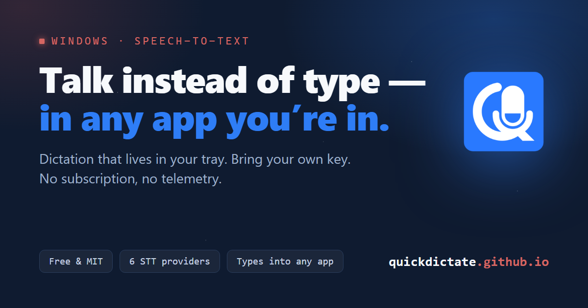
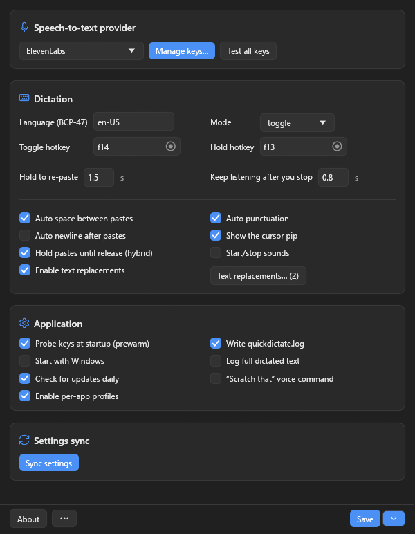

<h1>QuickDictate</h1>

<b>Press a key, talk, and your words land wherever your cursor already is.</b>

A tiny Windows tray app for voice dictation. Hold or tap a global hotkey, speak, and the
transcript types straight into whatever window has focus — your editor, a chat box, an email,
a terminal, any web text field. It runs on <i>your own</i> speech-to-text API key, so there's
<b>no subscription and no account</b>.

  <a href="https://quickdictate.github.io/"><b>🌐 Website</b></a>
  &nbsp;·&nbsp;
  <a href="https://github.com/LunarWerxs/QuickDictate/releases/latest"><b>⬇️ Download</b></a>
  &nbsp;·&nbsp;
  <a href="docs/GUIDE.md">📖 Full guide</a>

  
  
  
  
  

 

  
   
  <i>Everything lives in one small settings window — providers, keys, hotkeys, and toggles.</i>

## ✨ What you get

| | |
| :-- | :-- |
| 🔑 **Bring your own key** | Six providers to pick from — **ElevenLabs, Deepgram, OpenAI, AssemblyAI, DashScope, Google**. Add more than one and it round-robins with per-key health checks. |
| ⌨️ **Types into any window** | Whatever has focus — your editor, a chat box, a terminal, or a web form. |
| ✋ **Hold or tap** | Hold a key while you talk, or tap to start and stop. Both are configurable. |
| 💬 **Streams as you speak** | Words appear live as you talk on the streaming providers. |
| 🪄 **Little touches that add up** | A fix-list for words it mishears, per-app profiles, and a *"scratch that"* voice command. |
| 🔒 **Your data stays yours** | Nothing leaves your machine except your dictation audio (to the provider you picked), the optional daily check against GitHub Releases for a newer version (details in [SECURITY.md](.github/SECURITY.md)), and, only if you opt in, Connections settings sync (preferences only, never keys/audio). Toggle *Check for updates daily* off any time. |

## 🚀 Quick start

1. Grab the **[latest release](https://github.com/LunarWerxs/QuickDictate/releases/latest)** (or [build from source](docs/GUIDE.md#build-from-source)).
2. Copy `settings.example.json` to `settings.json`, next to `quickdictate.exe`.
3. Set `"stt_provider"` (say `"deepgram"`) and paste your key into that provider's array.
4. Run `quickdictate.exe`.
5. Press the hotkey — **F13** to hold, **F14** to toggle, by default — and start talking.

> [!TIP]
> First launch with no key? QuickDictate opens Settings for you, with a one-click **Manage keys…**
> button to paste a key and get going.

## 📚 Learn more

Every setting, per-provider setup, and the privacy details live in the
**[complete guide](docs/GUIDE.md)** — with provider-specific notes in
**[docs/providers.md](docs/providers.md)**.

## 📄 License

MIT — see [LICENSE](LICENSE). Made with care by **[LunarWerx Studios](https://lunarwerx.com)**.
