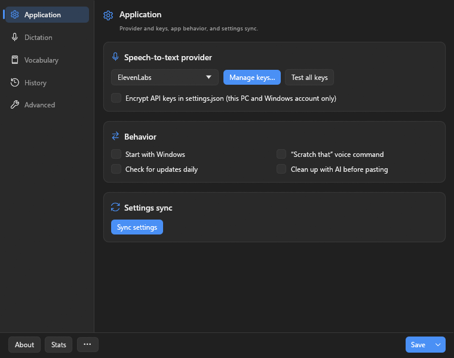

<h1>QuickDictate</h1>

<b>Press a key, talk, and your words land wherever your cursor already is.</b>

A tiny Windows tray app for voice dictation. Hold or tap a global hotkey, speak, and the
transcript types straight into whatever window has focus, your editor, a chat box, an email,
a terminal, any web text field. Use <i>your own</i> speech-to-text API key, or install an
optional local model for fully offline transcription, <b>no QuickDictate subscription or account</b>.

  <a href="https://quickdictate.github.io/"><b>🌐 Website</b></a>
  &nbsp;·&nbsp;
  <a href="https://github.com/LunarWerxs/QuickDictate/releases/latest"><b>⬇️ Download</b></a>
  &nbsp;·&nbsp;
  <a href="docs/GUIDE.md">📖 Full guide</a>

  
  
  
  
  

 

  
   
  <i>Everything lives in one small settings window, providers, keys, hotkeys, and toggles.</i>

QuickDictate is a Windows tray app for voice dictation that types your speech directly into
whatever window has focus, using your own speech-to-text API key from one of six cloud
providers or an optional fully offline local model, with no QuickDictate account,
subscription, or dashboard involved.

## 🆕 New in v0.5.0: fully offline dictation

Choose **Local (offline)** in Settings and QuickDictate can transcribe without an API
key or an internet connection. Microphone audio stays on your PC.

| Model | Download | Best fit |
| :-- | --: | :-- |
| **Cohere Transcribe 03-2026 Q5_K_M** | 1.65 GiB | Accuracy-first default |
| **Whisper Large v3 Turbo Q5_K_M** | 591 MiB | Smaller install and broader language coverage |

- **Manage everything in Settings:** install, select, cancel a download, or delete
  either model without hunting through folders.
- **Small app, on-demand models:** weights are not bundled in the executable or
  repository. They download to `%LOCALAPPDATA%\QuickDictate\local-stt`, use up to
  eight parallel connections when supported, and are size- and SHA-256-verified
  before use. The first install also adds a shared runtime of roughly 80 MiB.
- **Less waiting after setup:** the selected local model prewarms in the background
  and stays ready between dictations. QuickDictate shows a spinner during final
  local processing, queues an early next hotkey press, switches models automatically,
  and releases the model's RAM/VRAM when you return to a cloud provider.
- **Lighter long sessions:** audio, logging, clipboard, update, and network buffers
  are bounded; long Google recordings upload in ordered chunks; idle polling is
  reduced; and v0.5 fixes duplicate audio, non-BMP characters such as emoji, cold
  local results, and **Save & Restart** now returning to Settings.

## ✨ What you get

| | |
| :-- | :-- |
| 🔑 **Cloud or fully local** | Six bring-your-own-key services plus two optional offline models. Switch whenever you like. |
| ⌨️ **Types into any window** | Whatever has focus, your editor, a chat box, a terminal, or a web form. |
| ✋ **Hold or tap** | Hold a key while you talk, or tap to start and stop. Both are configurable. |
| 💬 **Clear live feedback** | Five cloud providers stream words as you talk; batch and Local modes show when the final result is processing. |
| 🪄 **Little touches that add up** | A custom vocabulary so your jargon is heard right the first time, a fix-list for words it mishears, per-app profiles, a searchable dictation history, and a *"scratch that"* voice command. |
| 🔒 **Your data stays yours** | Cloud audio goes only to the provider you pick; Local audio never leaves the PC. Optional settings sync is opt-in, and updates ask before installing. |

## 🚀 Quick start

1. Grab the **[latest release](https://github.com/LunarWerxs/QuickDictate/releases/latest)** (or [build from source](docs/GUIDE.md#build-from-source)).
2. Run `quickdictate.exe`. With no provider configured, Settings opens for you.
3. Pick how you want to transcribe:
   - **Cloud:** choose one of the six services and use **Manage keys…** to paste your API key.
   - **Offline:** choose **Local (offline)**, select Cohere or Whisper, and click **Install**.
4. Click **Save**, then press **F13** to hold or **F14** to toggle and start talking.

> [!TIP]
> Prefer files to forms? QuickDictate still keeps one readable `settings.json` next
> to the executable. Start from `settings.example.json` or edit the generated file.

> [!TIP]
> **Keeping the exe on your Desktop?** By default QuickDictate writes its `logs\`
> folder, usage stats, and update cache next to itself, which turns the Desktop
> into a scratch directory. **Settings ▸ Application ▸ Files** moves them: click
> **Use AppData** for `%LOCALAPPDATA%\QuickDictate`, or **Browse…** for anywhere
> you like. Existing files are moved across on the next start. (Or set `data_dir`
> in `settings.json`; `%VARIABLES%` are expanded.)

## 📚 Learn more

Every setting, per-provider setup, and the privacy details live in the
**[complete guide](docs/GUIDE.md)**, with provider-specific notes in
**[docs/providers.md](docs/providers.md)**, including local model and storage details.

## ⚖️ How it compares

QuickDictate isn't the only hotkey dictation tool out there. Here's how it stacks up against
a few real alternatives, based on their own public sites as of 2026-08:

| | QuickDictate | Wispr Flow | Talon Voice | Windows Voice Access |
| :-- | :-- | :-- | :-- | :-- |
| **Speech engine** | Your pick of 6 cloud APIs (bring your own key) or 2 offline local models | Wispr's own cloud service | A scriptable voice-command engine; not general transcription by default | Built-in on-device Windows recognition |
| **Account/cost** | No QuickDictate account, you pay your chosen provider directly, or nothing with Local | Free tier capped at 2,000 words/week on desktop and 1,000 on iPhone, unlimited on Android; Flow Pro or team plans for unlimited use | Free, developer accepts optional Patreon support | Free, built into Windows 11 |
| **Works offline** | Yes, with the optional Local provider (Cohere or Whisper) | No, cloud only | Yes, its bundled Conformer engine runs on-device | Yes, after a one-time language-pack download |
| **Platforms** | Windows 10/11 | Windows, macOS, iPhone, Android | Windows, macOS, Linux | Windows 11 22H2+ |
| **Built for** | Speak, and it types into whatever's focused | Speak, and it types into whatever's focused | Hands-free computer control and voice coding, driven by user-written scripts | Accessibility-focused dictation and PC control |

The short version: QuickDictate's main difference from Wispr Flow is where your audio and
money go, to whichever provider you pick directly, or nowhere at all with Local, instead of
through one bundled cloud subscription. Talon Voice solves a different problem, it's a
scriptable, hands-free control system built around voice commands (popular for voice coding),
not open-ended dictation. Windows Voice Access is free and on-device, but it only offers
Windows' own recognizer, with no choice of engine or provider.

## ❓ FAQ

**Is QuickDictate free?**
QuickDictate itself is free and MIT-licensed, with no subscription or account. You bring
your own API key for one of six cloud speech-to-text providers (ElevenLabs, Deepgram,
OpenAI, AssemblyAI, DashScope, or Google), which bill you directly per their own pricing,
or you can skip the cloud entirely and use the free offline Local provider.

**Does it work offline?**
Yes. Choose Local in Settings and install either the Cohere Transcribe or Whisper Large v3
Turbo model (1.65 GiB and 591 MiB respectively); once installed, microphone audio never
leaves your PC and no internet connection or API key is needed. The five cloud providers,
plus Google's batch mode, all require an internet connection.

**What are the system requirements?**
QuickDictate runs on Windows 10/11 x64 only, there's no Mac or Linux build. The app itself
is small; the optional offline models need extra disk space (591 MiB for Whisper, 1.65 GiB
for Cohere, plus an ~80 MiB shared runtime) and enough RAM/VRAM to keep the selected model
resident while Local is active.

**How is QuickDictate different from Wispr Flow, Talon Voice, or Windows Voice Access?**
QuickDictate lets you choose and pay your own cloud speech provider (or use a free offline
model) instead of routing through one bundled subscription like Wispr Flow. Talon Voice is
built for scripted hands-free control and voice coding, not open-ended dictation. Windows
Voice Access is free and on-device but locked to Windows' own recognizer.

**Is my data sent anywhere?**
Your microphone audio goes only to the one cloud provider you select (or nowhere, with the
Local option), never to the QuickDictate maintainer. The only thing QuickDictate itself
reports is an optional once-daily update check. An opt-in settings sync feature can also
sync preferences like hotkeys and language, but never your API keys, audio, or transcripts.

**Do I need an account to use QuickDictate?**
No. There's no QuickDictate account, login, or dashboard, the entire app is one local
Settings window. You'll need an account with whichever cloud provider you choose (to get an
API key), unless you pick the Local offline provider, which needs no account or key at all.

**Which speech-to-text providers does QuickDictate support?**
Six cloud providers, ElevenLabs, Deepgram, OpenAI, AssemblyAI, DashScope, and Google Cloud
Speech-to-Text, plus an offline Local option with a choice of two models (Cohere Transcribe
or Whisper Large v3 Turbo). Five of the six cloud providers stream words live as you talk;
Google and Local both return the full transcript when you release the hotkey.

**Can I use QuickDictate in any application?**
Yes. QuickDictate types the transcript into whatever window has focus when you release the
hotkey, code editors, browsers, chat apps, terminals, or any text field, since it works by
simulating keystrokes/clipboard paste rather than integrating with specific apps. Per-app
profiles can also change punctuation, spacing, or even which provider is used based on the
focused application.

## 📄 License

MIT, see [LICENSE](LICENSE). Made with care by **[LunarWerx Studios](https://lunarwerx.com)**.
Also from LunarWerx Studios: [RepoYeti](https://repoyeti.com),
[SageThumbs](https://sagethumbs.lunarwerx.com), and
[DevWebUI](https://devwebui.lunarwerx.com).
