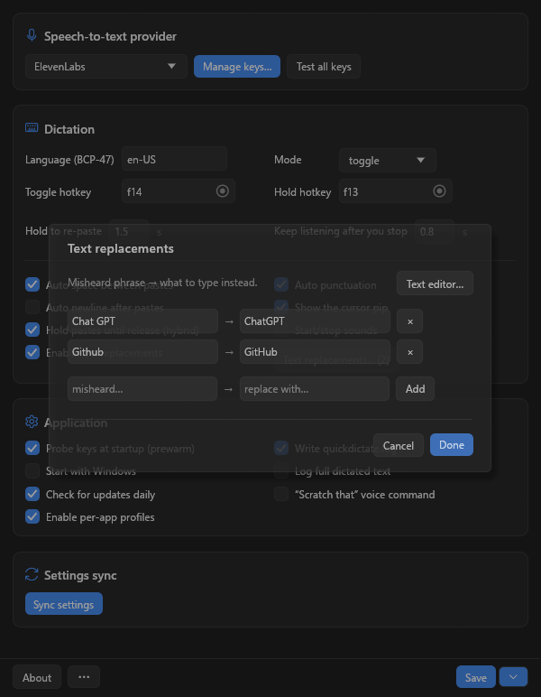

# QuickDictate — Complete Guide

The full documentation for QuickDictate. For the short version, see the [README](../README.md). The website lives at <https://quickdictate.github.io/>.

---

**Press a key, talk, and your words land wherever your cursor already is.**

That's the whole idea. QuickDictate is a small Windows app that sits in your tray, listens while you hold (or tap) a global hotkey, and types the transcript straight into whatever window has focus — your editor, a chat box, an email, a terminal, a text field on some website. It uses *your own* speech-to-text API key, so there's no subscription to us, no account to create, and no server of ours sitting between you and your words.

<p align="center">
  
  <br>
  <em>The entire app is one Settings window — no dashboard, no login, no cloud account.</em>
</p>

<p align="center">
  <a href="https://github.com/LunarWerxs/QuickDictate/releases/latest"></a>
  
  
</p>

## Why it exists

Most dictation tools do one of three annoying things: lock you into a monthly subscription, route your microphone through *their* servers, or bury the settings you actually want three menus deep. QuickDictate does the opposite. Bring a key from a speech provider you already trust, drop it in, and go. Your audio goes to that provider and nowhere else — we (the folks at [LunarWerx Studios](https://lunarwerx.com)) never see your voice or your keys. It's a **beta**, it's **MIT-licensed**, and it runs on **Windows 10/11 x64**.

See the [changelog](../CHANGELOG.md) for what's changed release to release.

## What you get

- **Six speech providers, your pick** — ElevenLabs, Deepgram, OpenAI, AssemblyAI, DashScope, and Google Cloud Speech-to-Text. Switch whenever you want.
- **Bring your own key** — your keys, your account, your usage. Add more than one key per provider and QuickDictate round-robins between them with per-key health tracking (alive / quota / dead) and cooldown backoff. Hit a dead key mid-sentence? It rotates to the next one automatically, without dropping your press.
- **Keys are checked before you need them** — on startup the active provider's keys get probed in the background, so a dead or rate-limited key is flagged before your first dictation and a good one is already queued. Health lives in memory only — a provider having a bad five minutes never permanently brands a key as dead; every launch re-checks.
- **Hold or toggle — your call** — hold a key while you talk, or tap once to start and once to stop. Both hotkeys are configurable.
- **Text streams in as you speak** — for the streaming providers, words paste back live instead of waiting for you to finish.
- **Fix the words it always mishears** — a small replacement table turns "Chat GPT" into "ChatGPT", "Github" into "GitHub", and whatever else your accent and your provider disagree on.
- **Updates itself, only if you let it** — an optional once-a-day check against GitHub releases (plus a button in Settings). Downloads are verified by size **and** SHA-256, and nothing installs until you say yes.
- **No telemetry, full stop** — the app doesn't phone home. Nothing leaves your machine except your dictation audio (to the provider you chose), the optional GitHub update check, and — only if you opt in — Connections settings sync (preferences only, never keys/audio).

That replacement table, since it's the fiddly-but-lovely part:

<p align="center">
  
  <br>
  <em>Teach it the words it keeps getting wrong. Edit inline, or paste a whole list at once.</em>
</p>

## 60-second quickstart

1. Grab the [latest release](https://github.com/LunarWerxs/QuickDictate/releases/latest) (or [build from source](#build-from-source)).
2. Copy `settings.example.json` to `settings.json`, right next to `quickdictate.exe`.
3. Set `"stt_provider"` to the provider you want — say `"deepgram"`.
4. Paste your API key into that provider's array — e.g. `"deepgram_keys": ["YOUR_KEY"]`.
5. Run `quickdictate.exe`.
6. Press the hotkey (**F13** to hold, **F14** to toggle by default) and start talking.

## Providers

| Provider | `stt_provider` value | Mode | Get a key |
|---|---|---|---|
| ElevenLabs (Scribe v2 realtime) | `elevenlabs` | Streaming | [elevenlabs.io/app/settings/api-keys](https://elevenlabs.io/app/settings/api-keys) |
| Deepgram (nova-3) | `deepgram` | Streaming | [console.deepgram.com/signup](https://console.deepgram.com/signup) |
| OpenAI (gpt-4o-transcribe, Realtime API) | `openai` | Streaming | [platform.openai.com/api-keys](https://platform.openai.com/api-keys) |
| AssemblyAI (Universal-Streaming v3) | `assemblyai` | Streaming | [assemblyai.com/dashboard/signup](https://www.assemblyai.com/dashboard/signup) |
| DashScope (Alibaba Cloud Paraformer realtime-v2) | `dashscope` | Streaming | [dashscope.console.aliyun.com/apiKey](https://dashscope.console.aliyun.com/apiKey) |
| Google Cloud Speech-to-Text (v1 batch) | `google` | Batch (record-then-send, no live word count, ~60s per request) | [console.cloud.google.com/apis/credentials](https://console.cloud.google.com/apis/credentials) |

A couple of gotchas:
- **Google** is the only non-streaming one. The prebuilt releases include it; if you're building yourself, turn it on with `cargo build --release --features google`.
- **DashScope is region-sensitive.** It defaults to the mainland-China host; set `"dashscope_intl": true` for the International host. A key from the wrong region just won't connect.

Full per-provider setup notes live in [docs/providers.md](providers.md).

## Settings reference

Everything lives in `settings.json` (copied from `settings.example.json`). The fields you'll actually touch:

| Field | Purpose |
|---|---|
| `stt_provider` | `"elevenlabs"` \| `"deepgram"` \| `"openai"` \| `"assemblyai"` \| `"dashscope"` \| `"google"` |
| `elevenlabs_keys`, `deepgram_keys`, `openai_keys`, `assemblyai_keys`, `dashscope_keys`, `google_keys` | Per-provider arrays of API keys; add more than one to enable round-robin + health tracking |
| `stt_model` | Optional model-override string (`null` = provider default) |
| `dashscope_intl` | `false` = mainland-China host (default), `true` = International host |
| `language` | BCP-47 language tag, e.g. `"en-US"` |
| `mode` | `"toggle"` or `"hold"` |
| `toggle_hotkey` / `hold_hotkey` | Default `"f14"` / `"f13"` |
| `reinsert_hold_ms` | How long a hold-mode key press must last before re-arming reinsert behavior, in ms (default `1500`) |
| `listen_tail_ms` | Extra trailing listen time after you stop talking, in ms (default `800`) |
| `delay_output_till_release` | Hybrid paste policy (bool) |
| `clipboard_restore_delay_ms` | Delay before restoring your previous clipboard contents after a clipboard-paste, in ms (default `300`) |
| `auto_space` / `auto_newline` / `auto_punct` | Output formatting toggles (bool) |
| `enable_sound` | Play a sound on state changes (bool) |
| `enable_logging` | Write `quickdictate.log` next to the exe (bool) |
| `log_transcripts` | Also log your full dictated text, not just summaries (bool, default `false`; deep debugging only) |
| `max_log_mb` | Log-file rotation cap, in MB, before `quickdictate.log` is rolled over (default `5`) |
| `update_auto_check` | Check GitHub for a newer release at startup, at most once/day (bool, default `true`); installing always asks first |
| `run_at_startup` | Start QuickDictate at Windows login via the per-user Run key (bool, default `false`) |
| `prewarm_keys` | Probe the active provider's keys at startup and queue a validated one (bool, default `true`) |
| `text_replacements` | JSON object mapping misheard phrases to corrections |
| `profiles_enabled` | Master on/off switch for per-app profiles (bool, default `true`), see [Per-App Profiles](#per-app-profiles) below |
| `profiles` | Per-application overrides, see [Per-App Profiles](#per-app-profiles) below |
| `voice_commands` | Enables the "scratch that" voice command (bool, default `false`), see [Voice Commands](#voice-commands) below |

A minimal Deepgram config:

```json
{
  "stt_provider": "deepgram",
  "deepgram_keys": ["YOUR_DEEPGRAM_API_KEY"],
  "language": "en-US",
  "mode": "toggle",
  "toggle_hotkey": "f14"
}
```

Switching providers later is just: change `stt_provider`, make sure that provider's key array is filled in, and restart. For a quick A/B test you don't even have to edit the file — `quickdictate.exe --provider <id>` overrides `stt_provider` for a single run (e.g. `quickdictate.exe --provider elevenlabs`).

## Per-App Profiles

Override punctuation/spacing/replacement behavior per foreground application, resolved from `settings.json`'s `profiles` array — no UI editor for the entries themselves (Settings shows a **read-only** "Active profiles" list; you add/edit/remove profiles directly in `settings.json`, same as text replacements' bulk editor is really just a friendlier view onto the same file).

```json
"profiles": [
  {
    "name": "Code editors",
    "match": ["code.exe", "windowsterminal.exe"],
    "auto_newline": true,
    "auto_space": false,
    "replacements_mode": "extend",
    "text_replacements": { "dot py": ".py", "underscore": "_" }
  }
]
```

- **`match`** is a list of exe basenames (case-insensitive, e.g. `"code.exe"`) checked against the foreground window at the moment a transcript is about to be pasted — not when you pressed the hotkey. If you dictate, then alt-tab elsewhere, then release, the profile for wherever focus landed is the one that applies.
- **First matching profile in the array wins.** No match → global settings apply, unchanged.
- Every override field is optional: `auto_punct`, `auto_space`, `auto_newline`, `text_replacements`. Anything you omit falls back to the corresponding top-level setting.
- **`replacements_mode`**: `"extend"` (default) layers the profile's `text_replacements` on top of the global map (profile wins on a key collision); `"replace"` uses only the profile's map.
- Switching the STT provider/keys per-app is **not** supported yet — every profile dictates through whatever `stt_provider` is globally active. May come in a future version.
- No `profiles` array (or an empty one) is byte-identical to today's behavior.
- **`profiles_enabled`** (bool, default `true`) is the master on/off switch, with a matching "Enable per-app profiles" checkbox on the Active profiles card in Settings -- flip it off to disable profile matching entirely (falling back to global settings) without deleting your `profiles` array.

## Voice Commands

A precision, deliberately tiny subset -- currently just **"scratch that"**. Off by default (`"voice_commands": false` in `settings.json`, with a matching checkbox in Settings → Application).

When enabled, if a **final** transcript ends with (or is exactly) the phrase "scratch that" -- case/punctuation-insensitive, so "Scratch that", "scratch that.", etc. all count -- QuickDictate:

1. Strips the command phrase itself out before anything is pasted.
2. Sends enough backspaces to undo the **previous** pasted chunk (keystroke- or clipboard-pasted, it doesn't matter -- both land as ordinary characters in the target app, so a plain backspace count undoes either).
3. If any words came *before* "scratch that" in the same transcript (e.g. "the quick brown fox, scratch that"), that leftover text is processed and pasted normally after the undo.

Only the single most recent paste is ever undone -- there's no multi-level undo stack, and the command only fires when it's the trailing phrase of the transcript ("scratch that" said mid-sentence, e.g. "let's scratch that idea", does not trigger). If there's no previous paste to undo (e.g. it's the very first thing you say), the command is a no-op.

A broader, pause-gated spoken-punctuation command set (saying "period", "comma", etc.) is intentionally **not** built -- naive punctuation-word matching against streamed transcripts is unreliable and is deferred indefinitely.

## Hotkeys & modes

- **Toggle mode** (default **F14**): press once to start listening, press again to stop and paste.
- **Hold mode** (default **F13**): hold the key while you talk, release to stop and paste.

Pick which one is live with `"mode": "toggle"` or `"mode": "hold"`, and change the keys with `"toggle_hotkey"` / `"hold_hotkey"`. While a session is running, a little status pip appears near your cursor: amber = starting, green = listening, red "!" = something went wrong.

The tray menu is deliberately bare — **Settings…**, a **Recent transcriptions** submenu (click any entry to **copy it to the clipboard** — up to the last 50, newest first), and **Quit**. Everything else is inside the Settings window: the provider picker, the key manager (with a live parallel "Test all" that hits the real APIs), the text-replacement editor, a per-field hotkey recorder, all the toggles, **About** and **Save / Save & Restart** in the pinned bottom bar, and a **⋯ menu** (next to About) holding **Check for updates**, **Open log file**, and **Edit settings.json** (for the advanced fields, in Notepad).

One nice touch: the global hotkeys re-register themselves every minute, so dictation keeps working after sleep/resume, a session lock, or an RDP reconnect — the usual moments where global hotkeys quietly die.

## Build from source

```sh
# Install Rust first: https://rustup.rs

# Standard build (the five streaming providers)
cargo build --release

# Add the Google Cloud batch provider
cargo build --release --features google
```

The binary lands at `target\release\quickdictate.exe`. Put `settings.example.json` next to it, rename it to `settings.json`, and add your key(s).

## Privacy

QuickDictate streams your microphone audio to the **one third-party STT provider you select** — and only that one. Your API keys and your audio never touch the QuickDictate maintainer. There's **no telemetry**; nothing leaves your machine except your dictation audio (to the provider you chose), the optional GitHub update check, and — only if you opt in — Connections settings sync, which syncs preferences only (mode, language, hotkeys, STT provider/model, etc.) and never your API keys, audio, or transcripts. See [docs/SETTINGS_SYNC.md](SETTINGS_SYNC.md) for details, including how to turn it off. Locally, it only uses the OS clipboard and keystroke APIs to paste text into your focused window.

Local logging (`enable_logging`) writes event summaries — not your recognized text — to `quickdictate.log` next to the exe. A separate `log_transcripts` setting, off by default, opts into logging the full dictated text for deep debugging; nothing written locally is ever sent anywhere.

More detail in [SECURITY.md](../.github/SECURITY.md).

## Antivirus / SmartScreen

The released `.exe` is currently **unsigned**, and QuickDictate installs a global hotkey and synthesizes keystrokes to paste text — which, to Windows Defender and SmartScreen, looks a lot like a keylogger. So you may get a "Windows protected your PC" prompt: click **More info** → **Run anyway**. Some antivirus tools may flag the binary too; it's a known false positive tied to the keystroke-injection technique, not anything malicious. Code signing is on the roadmap.

## Contributing

Bug reports and pull requests are welcome — there are issue templates under [.github/ISSUE_TEMPLATE](../.github/ISSUE_TEMPLATE), and the [CI checks](../.github/workflows/ci.yml) run against every PR.

## License

MIT — see [LICENSE](../LICENSE). Made by [LunarWerx Studios](https://lunarwerx.com).
